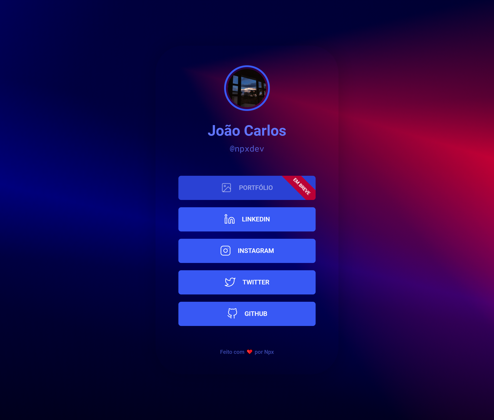

<h1 align="center">
  🔗 <b>Npx Links</b>
</h1>

  

## 🚀 Tecnologias

Esse projeto foi desenvolvido com as seguintes tecnologias:

- HTML
- CSS

## 💻 Projeto

Npx Links é um site para compartilhar diversos links em um único link.

Você pode visualizar o projeto em funcionamento através do link abaixo:

- **[Npx Links](https://npxlinks.vercel.app/)**

## 🔖 Layout

Você pode visualizar o layout do projeto através [desse link](https://efficient-sloth-d85.notion.site/Maratona-Explorer-2-0-7ed52d87338e472e9fc7c25180ca933f). É necessário ter conta no [Figma](https://figma.com) para acessá-lo.

---

Este projeto foi desenvolvido durante a **[Maratona Explorer 2.0](https://lp.rocketseat.com.br/inscricao/maratona-explorer)**, realizada pela **[@Rocketseat 💜](https://github.com/Rocketseat)**.
